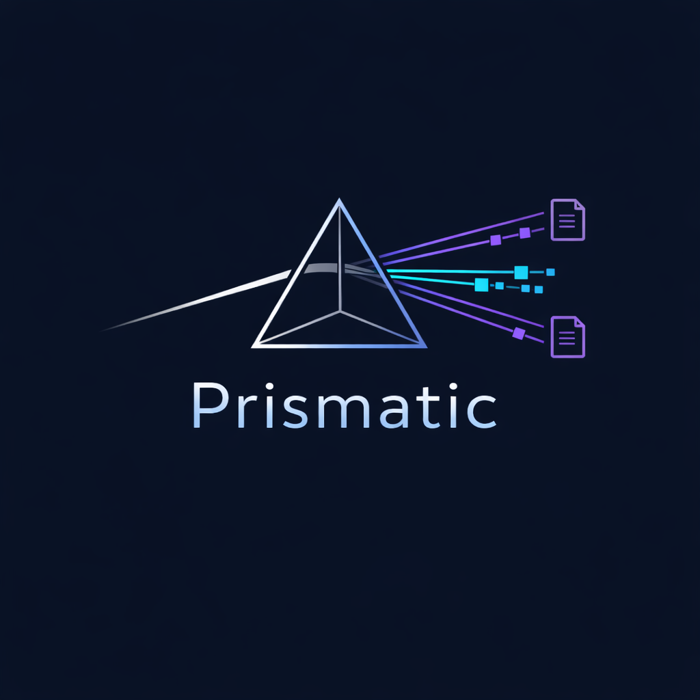

<div align="center">
  
  <h1>Prismatic</h1>
</div>

An n8n-based document intelligence pipeline. Uploads from Google Drive are parsed, domain-classified, and analyzed by Gemini — producing structured JSON with summary, entities, sentiment, and action items. Supports single files and ZIP archives — ZIP contents are unpacked and each file is processed individually.

## How it works

```
Google Drive (new file trigger — prismatic-input folder)
        │
        ▼
  Download file
        │
        ▼
  IF: is .zip?
        │
        ├─ true  → Unzip (Python) → N items with _fileBase64 + _fileName
        │
        └─ false → Extract from File → N items with _fileBase64
        │
        ▼ (both paths converge here)
  Tag Items — adds _total + _idx to every item
        │
        ▼
  Loop Over Items (SplitInBatches, size=1)
        │  1-minute gap between files
        ├──────────────────────────────────────────┐
        ▼                                          ▼
  Call Prismatic-File-Analyze              Call Rag Ingestion
        │
        ▼
  Prismatic File Analyze (called per file via Execute Workflow)
        │
        ▼
  Set node — injects _geminiApiKey from $env.GEMINI_API_KEY
        │
        ▼
  Python Code node: parse_document.py
        ├─ PDF  → pdfplumber  (text per page)
        ├─ DOCX → python-docx (paragraphs)
        └─ TXT  → plain read
                │
                └─ USE_VISION=True → Gemini Vision (gemini-2.5-flash-image)
                        (describes embedded images per page)
        │
        ▼
  Enriched output: { format, file_name, full_text, pages[] }
        │
        ▼
  ── EP3: AI Analysis ──────────────────────────────────────
        │
        ▼
  Code: detect_scenario.js   — builds classification prompt
        │
        ▼
  HTTP Request → Gemini Flash (classify)
        │
        ▼
  Code: extract_scenario.js  — outputs detected_scenario + scenario_reasoning
        │
        ▼
  Code: build_prompt.js      — builds domain-specific analysis prompt + requestBody
        │
        ▼
  HTTP Request → Gemini Flash (analyze)
        │
        ▼
  Code: parse_response.js    — validates + outputs gemini_flash
        │
        ▼
  Structured output: { summary, classification, sentiment, entities, action_items, confidence_score }
        │
        ▼
  ── EP4: Enrichment & Sensitivity ────────────────────────
        │
        ▼
  Code: diff_models.js       — compares Flash vs Pro, captures file metadata
        │                       and detected_scenario for downstream use
        ├──────────────────────────────────┐
        ▼                                  ▼
  HTTP → FastAPI /enrich            HTTP → FastAPI /sensitivity
  department, UUID, confidence      public / internal / confidential
                                    (OpenAI gpt-4o-mini verifies "confidential")
        └──────────────────────────────────┘
                           │
                           ▼
  Code: merge_results.js   — assembles final enriched record from all three nodes
        │                       includes source_zip when file came from a ZIP archive
```

### ZIP file handling

Upload a `.zip` file to the `prismatic-input` folder and the Controller automatically unpacks it. Each file inside is treated as an independent document — parsed, classified, and analyzed separately with a 1-minute gap between each to avoid rate limits.

Both ZIPs and single files converge into the same `Tag Items → Loop Over Items` path. This means even a bulk upload of individual files is handled uniformly — each file is tagged, throttled, and processed one at a time with a 1-minute gap.

Every extracted file carries a `_sourceZip` field (`{id, name}`) that traces it back to its archive. This appears in:
- The Google Sheets `source_zip` column
- The Markdown analysis report
- The summary notification email

Supported formats inside a ZIP: PDF, DOCX, TXT, MD. Other file types produce an `unsupported file type` error in the parsed output and are skipped gracefully.

### Detected scenarios

The pipeline auto-detects one of 9 domain scenarios and applies a matching analysis persona:

| Scenario | Domain |
|---|---|
| `business` | Corporate communications, memos, operations |
| `cybersecurity` | Incident reports, threat intelligence, audits |
| `financial` | Financial statements, investment reports |
| `hr` | Employment contracts, performance reviews |
| `product` | Product specs, market positioning |
| `academic` | Research papers, studies |
| `legal` | Contracts, regulations, compliance |
| `medical` | Clinical notes, diagnoses, treatment plans |
| `other` | Does not fit any of the above |

The Python code runs inside a dedicated **runners container** (not the main n8n container), which is how n8n supports Python on its hardened Alpine base image. See [`n8n-setup/README.md`](n8n-setup/README.md) for the full architecture.

## Project structure

```
prismatic/
├── dashboard/                     # Live intelligence dashboard (nginx, served on port 3000)
│   ├── index.html
│   ├── config.js                  # Runtime config (Sheet ID, webhook URL)
│   ├── prismatic-logo.png
│   ├── nginx.conf
│   └── Dockerfile
│
├── n8n-setup/              # Docker setup for n8n + Python runners
│   ├── config/
│   │   └── n8n-task-runners.json
│   ├── runners/
│   │   ├── Dockerfile
│   │   └── requirements.txt
│   ├── docker-compose.yml
│   ├── start-n8n.sh
│   ├── start-n8n.bat
│   └── README.md
│
├── n8n-workflows/                 # Exportable workflow JSON files
│   ├── Prismatic Controller.json
│   ├── Prismatic File Analyze.json
│   ├── Prismatic - Daily Digest.json
│   ├── Prismatic RAG Chatbot.json
│   └── Rag Ingestion.json
│
├── api/                           # FastAPI enrichment microservice
│   ├── main.py                    # 4 endpoints: /health /categories /enrich /sensitivity
│   ├── models.py                  # Pydantic models
│   ├── scenarios.toml             # 9 domain configs (pure data)
│   ├── scenarios.py               # TOML loader with Pydantic validation
│   ├── enrichment.py              # Department routing, UUID, confidence adjustment
│   ├── sensitivity.py             # Sensitivity classification (rule-based + LLM verify)
│   ├── verifier.py                # OpenAI gpt-4o-mini verification layer
│   ├── utils.py                   # Shared helpers (word-boundary keyword matching)
│   ├── Dockerfile
│   └── tests/
│
├── n8n_code_blocks/
│   ├── controller/
│   │   ├── tag_items.js           # Adds _total + _idx to each item for loop throttling
│   │   └── unzip.py               # Extracts ZIP contents → items with _fileBase64, _fileName,
│   │                              #   mimeType, fileExtension, _sourceZip
│   ├── parser/
│   │   └── parse_document.py      # Python Code node — paste into n8n
│   ├── gemini/
│   │   ├── detect_scenario.js     # Builds scenario classification request
│   │   ├── extract_scenario.js    # Parses detected_scenario from Gemini response
│   │   ├── build_prompt.js        # Builds domain-specific analysis request
│   │   ├── parse_response.js      # Validates and extracts gemini_flash output
│   │   └── diff_models.js         # Compares Flash vs Pro output; reads metadata from Start node
│   ├── fastapi-enrichment/
│   │   ├── merge_results.js       # Code node — assembles final record via $() references
│   │   └── http_nodes_config.md   # URL/body config for the 2 HTTP Request nodes
│   ├── daily-digest/
│   │   └── build-digest.js        # Builds the daily digest email body
│   ├── rag-agent/
│   │   ├── system_prompt.md       # RAG chatbot system prompt
│   │   └── response_schema.json   # Structured output schema for RAG responses
│   ├── notification/
│   │   ├── html_summary_email.js  # Builds HTML summary email (includes Source ZIP if present)
│   │   └── html_confidential_alert.js  # Builds urgent confidential alert email
│   └── reports/
│       └── generate_reports.js    # Builds JSON + MD reports (includes Source ZIP if present)
│
├── docs/
│   └── evidence/                  # Screenshots and evidence for submission
│
├── tests/                         # pytest suite for parse_document.py
│   ├── conftest.py
│   └── test_parse_document.py
│
└── .env.example                   # Environment variable template
```

## Quick start

### 1. Configure environment

```bash
cp .env.example .env
```

Edit `.env` and fill in:

| Variable | Description |
|---|---|
| `GEMINI_API_KEY` | Google Gemini API key |
| `N8N_RUNNERS_AUTH_TOKEN` | Random secret shared between n8n and the runners container |
| `N8N_BASIC_AUTH_USER` | n8n UI login username |
| `N8N_BASIC_AUTH_PASSWORD` | n8n UI login password |
| `GENERIC_TIMEZONE` | Timezone for n8n scheduler (e.g. `Asia/Jerusalem`) |
| `OPENAI_API_KEY` | OpenAI API key for sensitivity LLM verification (optional — falls back to rule-based if unset) |
| `NOTIFY_EMAIL` | Comma-separated recipient list for Gmail notification workflows |
| `GOOGLE_SHEET_ID` | Google Sheet ID used by the API and dashboard |
| `GOOGLE_SHEETS_API_KEY` | Restricted API key with Sheets read access (for dashboard) |
| `DASHBOARD_WEBHOOK_URL` | n8n RAG chat webhook URL consumed by the dashboard |

Generate a secure token:
```bash
python3 -c "import secrets; print(secrets.token_hex(32))"
```

### 2. Start n8n

```bash
docker compose -f n8n-setup/docker-compose.yml --env-file .env up -d n8n runners
```

On Linux/macOS: `bash n8n-setup/start-n8n.sh`
On Windows: double-click `n8n-setup/start-n8n.bat`

n8n will be available at [http://localhost:5678](http://localhost:5678).

### 3. Import workflows

In n8n: **Settings → Import** and upload each JSON from `n8n-workflows/` in this order:

1. `Prismatic File Analyze.json`
2. `Prismatic Controller.json`
3. `Prismatic - Daily Digest.json`
4. `Prismatic RAG Chatbot.json` + `Rag Ingestion.json` (optional — RAG features)

### 5. Wire the parser in n8n

1. Add a **Set** node before the Python Code node and set:
   - Field: `_geminiApiKey` → Value: `{{ $env.GEMINI_API_KEY }}` (expression mode)
   - Enable **Include Other Input Fields**

2. Paste `n8n_code_blocks/parser/parse_document.py` into a **Python Code** node.

3. **Optional:** set `USE_VISION = True` at the top of the script to have embedded images described by Gemini Vision.

### 6. Wire the AI analysis in n8n

Add these nodes after the parser, in order:

| Node | Type | Config |
|---|---|---|
| Detect Scenario | Code | paste `detect_scenario.js` |
| Gemini Flash (classify) | HTTP Request | POST `…/gemini-2.5-flash:generateContent?key={{ $env.GEMINI_API_KEY }}`, body `={{ $json.requestBody }}` |
| Extract Scenario | Code | paste `extract_scenario.js` |
| Build Prompt | Code | paste `build_prompt.js` |
| Gemini Flash (analyze) | HTTP Request | same URL as above, body `={{ $json.requestBody }}` |
| Parse Response | Code | paste `parse_response.js` |

### 7. Wire the enrichment in n8n

Add these nodes after **Final Result With Models Diff**, running Enrich and Sensitivity **in parallel**:

| Node | Type | Config |
|---|---|---|
| Final Result With Models Diff | Code | paste `diff_models.js` (updated — now also outputs file metadata and detected_scenario) |
| FastAPI - Enrich | HTTP Request | POST `http://api:8000/enrich`, body `{{ JSON.stringify({ scenario: $json.detected_scenario, data: $json.gemini_flash }) }}` |
| FastAPI - Sensitivity | HTTP Request | POST `http://api:8000/sensitivity`, body `{{ JSON.stringify({ scenario: $json.detected_scenario, data: $json.gemini_flash }) }}` |
| Merge Results | Code | paste `merge_results.js` |

Wire both HTTP nodes from **Final Result With Models Diff** (parallel branches), then wire both into **Merge Results**. The Code node uses `$()` references to pull from all three upstream nodes.

## Running tests

Parser tests (root):

```bash
poetry run pytest
```

API tests:

```bash
cd api && poetry run pytest
```

Parser tests cover: PDF parsing, DOCX parsing, plain text, Vision fallback behaviour, `process_items` edge cases (missing binary, unsupported extension, multiple items, field preservation). API tests cover all 4 endpoints, enrichment routing, and sensitivity classification.

## Python dependencies

| Package | Purpose |
|---|---|
| `pdfplumber` | PDF text extraction |
| `python-docx` | DOCX text and image extraction |
| `google-genai` | Gemini Vision for image descriptions |

Dependencies are declared in both `pyproject.toml` (for local dev/tests) and `n8n-setup/runners/requirements.txt` (for the Docker runners container).

## FastAPI Enrichment API

A standalone Python microservice (`api/`) that enriches Gemini output with routing and sensitivity metadata. Runs as a Docker container alongside n8n.

### Endpoints

| Endpoint | Method | Purpose |
|---|---|---|
| `/health` | GET | Health check |
| `/categories` | GET | List all 9 supported domain scenarios |
| `/enrich` | POST | Route document to department, assign UUID, adjust confidence |
| `/sensitivity` | POST | Classify document as public / internal / confidential |

### Request body (both POST endpoints)

```json
{
  "scenario": "business",
  "data": { "...gemini_flash fields..." }
}
```

### Sensitivity verification

The `/sensitivity` endpoint uses a two-layer approach:
1. **Rule-based** — keyword matching with word-boundary regex across scenario-specific and global sensitive keyword lists
2. **LLM verification** — when the rule-based result is `"confidential"`, OpenAI `gpt-4o-mini` independently verifies the classification. If OpenAI disagrees, the less restrictive level wins. Falls back silently to rule-based if no `OPENAI_API_KEY` is set or the call fails.

Response includes `"llm_verified": true/false` so you can track when LLM verification ran.

### Starting the API

```bash
docker compose -f n8n-setup/docker-compose.yml --env-file .env up -d api
```

The API starts automatically before n8n (enforced via `depends_on: condition: service_healthy`).

## Live Dashboard

Start the dashboard container:

```bash
docker compose -f n8n-setup/docker-compose.yml --env-file .env up -d dashboard
```

Then open [http://localhost:3000](http://localhost:3000) in your browser.
